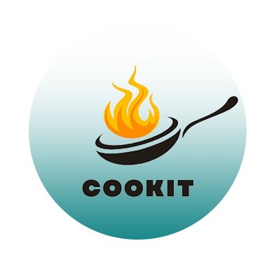

# CookIt App



## Table of Contents
- [Introduction](#introduction)
- [Features](#features)
- [Technologies Used](#technologies-used)
- [Setup and Installation](#setup-and-installation)
- [Usage](#usage)
- [Project Structure](#project-structure)
- [Contributing](#contributing)
- [APK Download](#apk-download)
- [Contact](#contact)

## Introduction
CookIt is a Flutter-based mobile application designed to provide users with a dynamic and engaging experience for exploring and discovering various meals. The app follows the MVVM architecture and utilizes Bloc (Cubit) for state management, ensuring a clean and maintainable codebase.

## Features
- **Dynamic Home Page:** A responsive home page that adapts to various screen sizes and orientations.
- **Advanced Search Functionality:** Allows users to search for meals based on different criteria.
- **Country-Based Meal Exploration:** Enables users to explore meals specific to different countries.
- **External API Integration:** Fetches meal data from external APIs to keep the content fresh and up-to-date.
- **Dark Mode Support:** Offers a customizable user interface with dark mode for better user experience.

## Technologies Used
- **Framework:** Flutter
- **State Management:** Bloc (Cubit)
- **Architecture:** MVVM
- **APIs:** Integrated external APIs for meal data

## Setup and Installation
To run this project locally, follow these steps:

1. **Clone the repository:**
    ```bash
    git clone https://github.com/your-username/CookIt-App.git
    cd CookIt-App
    ```

2. **Install dependencies:**
    ```bash
    flutter pub get
    ```

3. **Run the app:**
    - For mobile:
      ```bash
      flutter run
      ```

## Usage
To use the CookIt app, follow these steps:

1. **Run the app:**
   ```bash
   flutter run

2. **Explore the Home Page:**
Navigate through the dynamic home page to explore various meals.

3. **Search for Meals:**
Use the advanced search functionality to find specific meals based on your preferences.

5. **Explore Meals by Country:**
Browse meals based on different countries to discover unique recipes and dishes.

7. **Toggle Dark Mode:**
Enable or disable dark mode from the app settings to suit your visual preference.

## Project Structure
```plaintext
CookIt-App/
├── lib/
│   ├── core/
│   │   ├── error/
│   │   ├── theme/
│   │   ├── utils/
│   │   └── widget/
│   ├── feature/
│   │   ├── countries/
│   │   │   ├── data/
│   │   │   └── presentation/
│   │   ├── homepage/
│   │   │   ├── data/
│   │   │   └── presentation/
│   │   ├── search/
│   │   │   ├── data/
│   │   │   └── presentation/
│   │   └── splash/
│   │       ├── data/
│   │       └── presentation/
│   ├── constants.dart
│   └── main.dart
├── test/
├── .gitignore
├── pubspec.yaml
└── README.md
```
## Contributing
Contributions are welcome! Please follow these steps:

1. Fork the repository.
2. Create a new branch (git checkout -b feature/your-feature).
3. Commit your changes (git commit -m 'Add some feature').
4. Push to the branch (git push origin feature/your-feature).
5. Open a pull request.
   
## APK Download

You can download the APK file for the Slash App from the following link:

[CookIt App APK Download](https://drive.google.com/file/d/1jqg6_2hMvWMLKMc02XEjMK0XJLZfz4aH/view?usp=sharing)

## Contact

For any questions or suggestions, feel free to contact me:

Email: washraf124@gmail.com
LinkedIn: [Waheed Ashraf](https://www.linkedin.com/in/waheed-ashraf-18a197214/)
